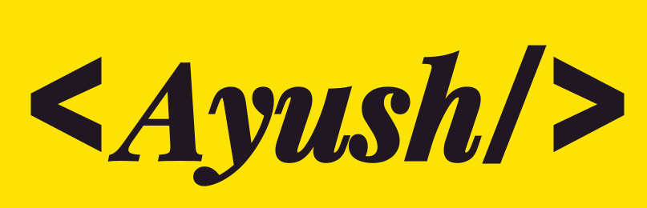

# **Hi, I'm Ayush Yadav** &nbsp;

Welcome to my profile. I'm a full-stack web developer with interset in MERN stack. I would love to <a href="https://ayushy.dev">connect</a>

 &nbsp;
 &nbsp;

## Tech Stack:

 &nbsp;
 &nbsp;
 &nbsp;
 &nbsp; 
 &nbsp;
 &nbsp;
 &nbsp;

---

\

